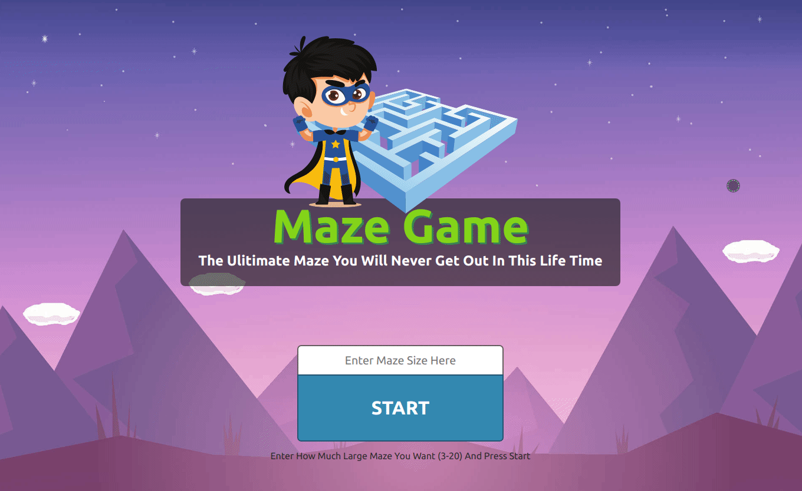

# **Maze Game**

MazeGame is a React game app where player have to collect all the mushrooms to win.

See Live Demo at [here](https://objective-shannon-989792.netlify.com).

  

---

## **How To Play**

- First type how much larger "Maze Size" you want to play in text box. (Maze Size Range Is 3-20)
- Then Click Start Button.
- Then navigate the character using "Arrow Keys" to collect mushrooms.
- Once all mushrooms in maze collected user wins.

---

## **Project Build Dashboards**

- [Docker Hub Images](https://cloud.docker.com/u/sandunwebdev/repository/docker/sandunwebdev/maze-game-image-prod)

---

## **Used Technologies**

| FrontEnd     | BackEnd | Tools             | Other  |
| ------------ | ------- | ----------------- | ------ |
| React        | -       | ESLint + Prettier | Docker |
| React Router |         |                   | NginX  |
| Howler       |         |                   |        |

---

## **How To Run**

### # USING DOCKER

- Just run `npm run docker:dev:run`. It will install and run all the dependencies and services need to run this project. Then you can interact with the program through http://localhost:3000.
- Use `npm run docker:dev:stop` to stop Docker containers gracefully (otherwise unexpected errors occurs sometimes.) and `npm run docker:dev:test` to test inside the container.
- Also already built "Docker Images" of this project can be found in [here].(https://cloud.docker.com/repository/docker/sandunwebdev/maze-game-image-prod).

### # USING NORMAL WAY

- Run `npm install` to install dependencies.
- Then run `npm start`.
- Then you can interact with program through http://localhost:3000.

---

## **How To Debug**

- Just run `F5` in VSCode (Configurations Already Added).
- You know the rest. Happy Debugging. 😄

---

## **How To Lint**

- React Webpack Development Server configured to automatically takes care of "Linting/Code Formattinh" with "ESLint" and "Prettier".
- But If you want to manually just run `npm run lint`.

---
